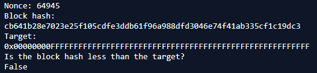

# Mineração de Bitcoin em Python
Uma implementação Python do algoritmo de mineração Bitcoin

Este pequeno script é uma pseudo-simulação do processo de mineração de blocos Bitcoin Genesis.

Dados os dados do bloco Genesis, este script faz um hash duplo usando SHA-256 e tenta encontrar um hash menor que o alvo Genesis.

## Saída de Amostra

